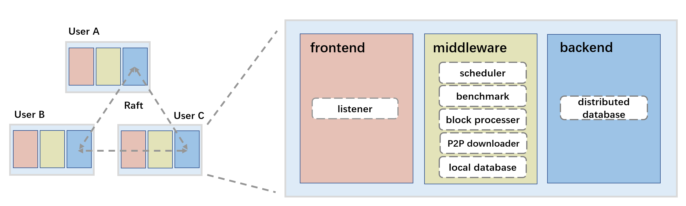

# StreamRipper: An Adaptive Distributed Network Cache on LAN
  

Project Repo for CS339: Computer Networking.

## Main Features

This project provide an acceleration service for [Bilibili](https://www.bilibili.com). For more information, please see `paper.pdf`.




## Getting Started

:warning: DO NOT modify file structure.

### Backend

Download `rqlite`  & Install `pyrqlite`

### Frontend

Download `SwitchyOmega`

Set http proxy `127.0.0.1:8080` (mitmproxy port)

Add proxy rule `*.bilivideo.com`

Add mitmproxy Certificates

```bash
pip install mitmproxy
```

### Requirements

```bash
sudo apt install curl
sudo apt install ubuntu-restricted-extras # for firefox
pip install speedtest-cli
pip install icecream # for debug
```

### Run it ! :smiley:

```python
python start.py
```

## Code Structure

```
├── src
│   ├── Backend
│   │   └── backend.py
│   ├── frontend.py
│   ├── Middleware
│   │   ├── local_DB.py
│   │   ├── main.py
│   │   ├── P2P
│   │   │   ├── client.py
│   │   │   └── server.py
│   │   ├── scheduler
│   │   │   ├── scheduler.py
│   │   │   └── speed_test.py
│   │   ├── split.py
│   │   └── utils.py
│   ├── start.py
│   └── utils.py
└── tests    # test and demo
```
